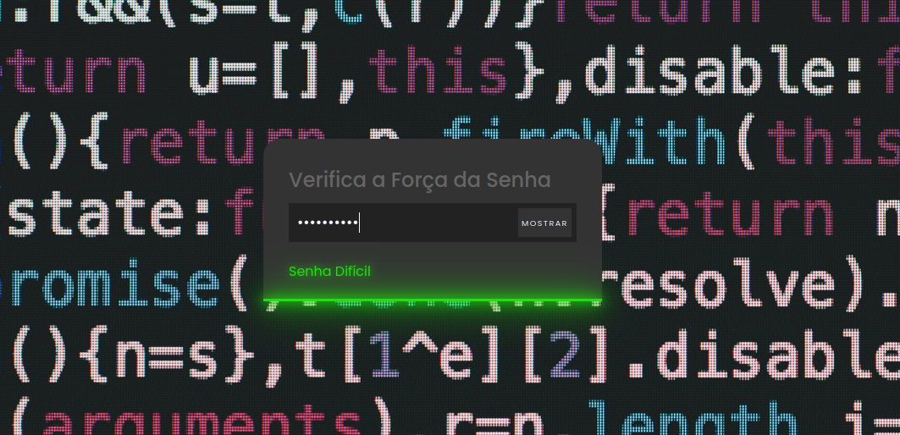

# Segurança_Password

Um verificador de força de senha simples e interativo, desenvolvido em HTML, CSS e JavaScript. O projeto avalia a força de uma senha com base em critérios como comprimento, uso de letras maiúsculas, minúsculas, números e caracteres especiais.

 <!-- Adicione uma imagem de demonstração aqui -->

## Funcionalidades

- **Verificação de força da senha**: Classifica a senha como **Fácil**, **Média** ou **Difícil**.
- **Feedback visual**: Exibe a força da senha com cores e mensagens intuitivas.
- **Alternar visibilidade da senha**: Permite mostrar ou ocultar a senha digitada.

## Como Usar

1. Clone o repositório:
   ```bash
   git clone https://github.com/brunno2269/seguranca_password.git
